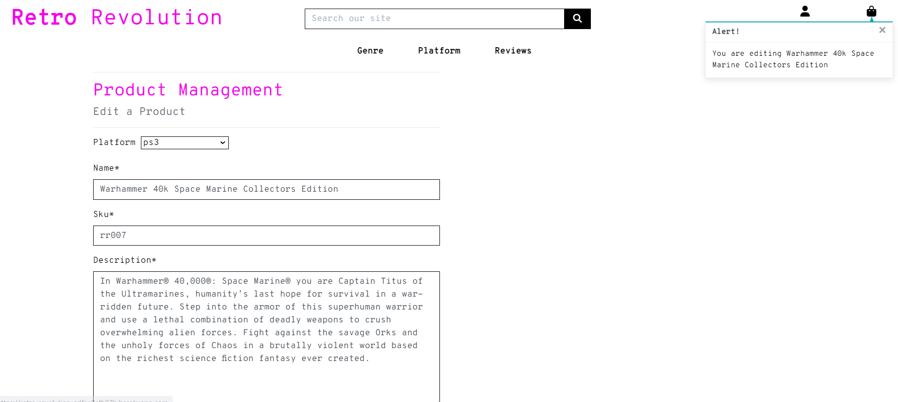

# Retro Revolution

Welcome to Retro Revolution. An e-commerce store selling one off collectable retro videos games, consoles and strategy guides.

[View live website](/https://retro-revolution-edfee9efb97b.herokuapp.com/)

[View admin site](https://retro-revolution-edfee9efb97b.herokuapp.com/admin/)

## User Experience

This website was designed using the Five Planes of UX

### Strategy Plane

User stories were written using GitHub Issues and were priortised using the MoSCow method. Full list of stories can be found [here](https://github.com/Lornavav/retro-revolution/issues?q=is%3Aissue+is%3Aclosed) and full testing of user stories can be found [here](TESTING.md).

### Scope Plane

The scope of the project was to create an e-commerce website where users can purchase products using a payment gateway in this case Stripe. Users should also have the ability to perfom CRUD. Users should have the use of custom models created by the site owner where they can perform actions that manipulate the databse in the backend.

### Structure

We kept the structure mostly the same as the Boutique Ado walkthrough project. This seems to be the layout for alot of the e-commerce websites out there so users will be familiar with the layout. There is a header and footer which stays the same throughout the whole site. The navigation bar remains the same throughout the site too with plenty of category options on each page making it easy to navigate the website.

### Skeleton Plane

Desktop and mobile wireframes were created using [balsamiq](https://balsamiq.com/) in the planning stage of the project. The wishlist was never implmented and will be a future feature.

### Surface Plane

#### Colour Scheme

I really wanted to use a cool hero image for the website and I found great ones on [Unsplash](https://unsplash.com/s/photos/arcade). I loved the neon retro vibes. I wanted to keep the colour scheme simple as I have fell down in the bast for bad contrast. So just went with Pink, White and Black mainly. Still some small contrasting issues which can be fixed in the future.

I created this colour palette using [coolors](https://coolors.co/).

#### Typography

I went with same font as used in my PP4 as it suited the retro and gaming vibe in my opinion. I imported Overpass Mono from [Google Fonts](https://fonts.google.com/)

## Agile Development

GitHub Issues and Projects were used to write and manage user stories and epics. The kanban board was used to manage stories into Todo, In Progress and Done columns. I used the MoSCoW method to label must-have and should-have stories. I did have the intention of adding some could-haves but didn't get around to it so these will be included in the future features section below.

[View project board here](https://github.com/users/Lornavav/projects/5/views/1)

### Milestones

I implemented milstones in this project and broke the work up into 4 sprints. I didn't stick to the time lines and kind of jumped around between the milestones which I know wouldnt happen in the real world but I was concious of this and can see the benifit of milestones so I look forward to using them better in future projects.

[View milestones here](https://github.com/Lornavav/retro-revolution/milestones?state=closed)

## Existing Features

### Header

The header contains delivery information. A search bar with error handling. Menu options to choose a genre of game or games to suit a particular platform. A menu option to leave a review. My account heading that will have differebt options depending on the level of user and if a user is signed in or not. And a bag icon to show items added to the cart.

### Hero Image

Hero image with a call to action shop now button directing the user to a page where they can view all the collectables.

### Favicon

Favicon was created on [gauger.io](https://gauger.io/fonticon/).

### Footer

The footer contains contact details for the site owners, links to social media that open in a new tab. A mailchimp sign up that add the users emails to a mailing list. A privacy policy that opens in a new tab.

### View All Collectables

This page shows all the collectables on the website grouped together.

### Collectable Detail Page

This page shows more detail of the collectable displayed on their own single page.

### Add a new collectable (admin only)

This page is restricted to staff users only. This page is wher staff can collectables to the site without having to access the admin panel.

### Edit/ Delete Collectables (admin only)

These buttons allow the admin to edit or delete a collecatble. There is currently no delete confirmation on the delete feature and there really should be so will implement this as a future feature.

### Messaging prompts 

Message prompts are thourhgout the whole site, letting a user know when they have completed an action.

### Sell a Collectable

This feature allows any user to submit a form to the site owner notifying them that they would be interested in selling a collecatble on the website. The admin can view these form details which have been submitted through the admin site.

### Submit a Review

This feature allows the user to submit a review which is displayed straight away on the same page. Currently there is no recaptcha to check for span or no approval systems, this should be implemented as a future feature for security reasons.

### Checkout with Stripe

There are a few layers to this process, ther is a bag summary page where the user can see what they are buying and can remove items form the cart if they wish. Then if they proceed to checkout they need to fill out a form and enter card details. This will handle successful and unsuccessful payments and the user will be infomred of same. If the user processes a successful transaction they will recive order detail on the screen and a confirmation of their order.

### Emails on registration and payment coming from gmail

When a user performs any sign up or forgotten password actions they will receive emails form the website thanks to the help of django allauth. These emails come from the websites own gmail account. The user will also receive an email for any payment made. I have just noticed the $ in the email it should be €, I have made the adjustment to the code.

## Search Engine Optimization (SEO) and Web Marketing

### Business Model

Retro Revolution is a business to consumer (B2C) e-commerce website. The main goal of the website is to sell collectable video games or related items to gamers of all ages. It gives consumers the opportunity to sell their own items too which creates a nice B2C relationship. The website is aimed at all ages it could be younger kids looking to play retro games like commodore 64, or it could be 40+ year olds who used to own these retro games and want to play again for a bit of nostalgia.

### SEO

* Descriptive meta tags were added to base.html which is extended on all the pages. Including title, description and keywords

* [XML-Sitemaps](https://www.xml-sitemaps.com/) was used to create a sitemap.xml file as shown in CI SEO module. This is an important feature as it helps Google crawl the essential pages or our website.

* robots.txt file was implmented as per guidelines from CI SEO module. This is essential to a website and used to tell Google which files not to ccrawl on your site.

### Social Media Marketing

I created a mock up Facebook page to drive business to the website. Here we will update our followers of the latest arrivals to our site.

### Email Marketing

There is a [mailchimp](!https://mailchimp.com/) sign up a form embedded on the footer which users can choose to sign up to a newsletter, this will create a subscribtion list in mailchimp where we can then choose to send out market campaigns to our subscribers.

### Privacy Policy

A Privacy Policy has been included in the footer, this was create as per recommendations in the CI module and was created using [TermsFeed](https://www.termsfeed.com/) and is hosted on their website.

## Technologies Used

- [HTML](https://html.com/html5/) used as the mark-up language.
- [CSS](https://en.wikipedia.org/wiki/CSS) for styling.
- [Python](https://www.python.org/) used as the programming language.
- [Django](https://www.djangoproject.com/) framework inlluding some of the below frameworks.
  - [Django Crispy Forms](https://django-crispy-forms.readthedocs.io/en/latest/) for form styling and helpers.
  - [Django allauth](https://django-allauth.readthedocs.io/en/latest/) provided templates for sign in, sign up and sign out.
  - [Crispy Bootstrap 5] template pack for boostrap 5.
  - [Django summernot] for rich text editor for adding posts.
- [ElephantSQL](https://www.elephantsql.com/) database used.
- [Bootstrap 5](https://pypi.org/project/crispy-bootstrap5/) for website styling.
- [Cloudinary](https://cloudinary.com/) to store static files.
- [GIT] for version control.
- [GiHub](https://git-scm.com/) for repository and issues and project board.
- [Codeanywhere](https://app.codeanywhere.com/) fs IDE. For most of my project and then switched to [Gitpod](https://www.gitpod.io/) with a few days to go.
- [Heroku](https://www.heroku.com/) for website deployment.
- [Google Fonts](https://fonts.google.com/) for typogoraphy.
- [Font Awesome](https://fontawesome.com/) for website icons.
- [Balsamiq](https://balsamiq.com/) for mobile wireframes.
- [Stripe](https://stripe.com/ie)

## Testing and Validation

Testing documentation can be found at [TESTING.md]

## Deployment

### Deployment with Heroku

- Created an account with Heroku and log in through the [Heroku](https://www.heroku.com/) website.
- From the dashboard click on the 'New' option and selected 'Create New App.
- Add in an app name and choose a region and click 'Create app'.
- Click on the 'Settings' tab and from the 'Config Vars' section click 'Reveal Config Vars'
  - For my project I needed to add my database url, secret key and coudinary url, email variables to sent emails from gmail, Stripe secret and public keys and Stripe webhook secret key in the config vars section.
- From the buildpacks section click 'Add buildpack'.
- Go to the 'Deploy' tab and under 'Deployment Method' click on 'GitHub'.
- From the 'Connect to GitHub' section ensure the correct repository is selected and then search for the repository you want to connect to and click 'Connect'.
- You can choose an automatic deploy or a manual deploy. I chose a manual deploy.
- With a manual deploy I made sure the main branch was selected and clicked 'deploy branch'.
- Once the build is finished there should be a message saying 'Your app was successfully deployed' with a 'View' button.
- When I click on 'View' this opened the application.

### Steps to clone site

To create a copy of the repository on your own account, follow the below steps:

- Navigate to [My Repository Page](https://github.com/Lornavav/retro-revolution).
- Click on 'Fork' up on the top right of the page.
- There will now be a copy of the original repository in your Github account.

## Credits

### Code

* The majority of the boilerplate code is taken from the Boutique Ado walkthrough. Espically towards the end of my project where I had set out using Bootstrap 5 it was causing me isssues so I went back and installed the Bootstap 4 version and took the boileplate then.
* Alot of inspiration came from projects shared by my facilitator Paul Thomas and my cohort lead Dave Trev as example projects. These were:
    - [The Kitbag](https://the-kitbag.herokuapp.com/)
    - [Retro Reboot](https://retro-reboot.herokuapp.com/) - (I promise I came up with the name for my site before this was brought to me!)

### Media
* All media used for the products is my husbands own collection, so thank you to him for photgraphing it for me.

### Acknowledgements

- I would like to give a special mention to Dayana-N who spend a lot of time with me the other night despite having no sleep and just had submit her own project to help me fix a bug and to give me code inspiration on how to implement the sold out feature.
- Another mention to Indrek from my cohort who spent a lot of time with me last night trying to fix some CSS and giving general tips and advice.

  
